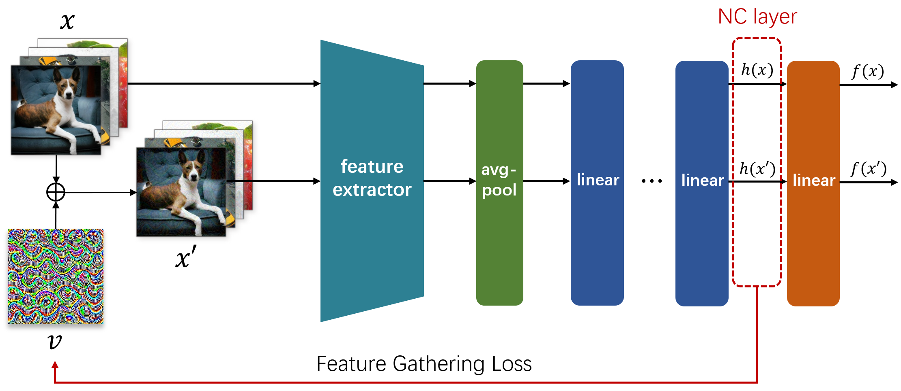

# FG-UAP: Feature-Gathering Universal Adversarial Perturbation

 This is the code for the experiments of our paper. You can find the arXiv version of the paper here: !!!!To be filled in



## Citation

```bib
@article{!!!To be filled in
}
```


### Environment

```
pip install torch==1.11.0 torchvision==0.12.0 torchaudio==0.11.0
pip install tqdm
```

### Path setting

Please change the data path and result path to your own path in the following three lines.

```
parser.add_argument('--train_data_dir', default='path_of_train_data', type=str)
parser.add_argument('--val_data_dir', default='path_of_validation_data', type=str)
parser.add_argument('--result_dir', default='path_of_result_dir', type=str)
```

### Generate FG-UAP

Now you can craft an FG-UAP for vgg16 by running 

```
python find_uap.py --model_name vgg16 
```

Change the target to generate targeted FG-UAP

```
python find_uap.py --model_name vgg16 --target 1
```

Top-k parameter is used for calculating Dominance Ratios. Run the following code to get the $1st$, $3rd$, and $5th$ dominance ratio.

```
python find_uap.py --model_name vgg16 --top_k 1 3 5
```

